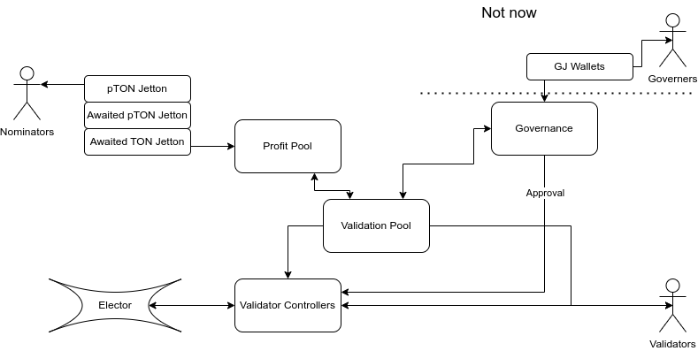

This documentation is organised as follows:
- short description
- list of all components (each component is isolated in separate contract)
- list of all component-to-component interfaces
- list of all multicomponent execution paths

## Description
### Terms
- elector: smart-contract which accepts stakes, conduct election, decides next active validator keys and distribute reward for validation
- Сontroller: smart-contract which manage funds for stake 
- validator: actor which running TON node and (try to) participate in elections, and if elected validate new blocks. It knows it's private validator key and also "partially" control it's own Сontroller (can send and receive stakes, but can not withdraw all money for itself)
- nominator: actor who have assets (TON) and want to lend them to validators through JettonPool to get interest on it
- jettons: TEP-74+TEP-89 Jettons : scalable tokens on TON blockchain

### Scheme

**Validators** participate in elections via **Сontroller** which

1. Requests funds from Validation Pool through **Validator approval**
2. accept and account funds from validation pool and validators
3. ensures that assets lended to validators can not be withdrawn
4. sends stake plus agreed on lending interest after validation round to validation pool

**Pool** Single contract with two roles
  - Interaction with controllers
    1. Lends assets to Сontrollers upon borrow request from **Сontroller** in accordance to *Current Rate*
    2. Receives assets and aggregates profit/loss information from **Сontrollers**
    3. Manages funds from Profit Pool
    4. Notify Profit Pool about aggregated data
    5. Update *Current Rate* in accordance to *Desired Utilization*.
  - Interaction with stakers
    6. manages deposits and withdrawals

**pTON** is jetton which is used to manage assets lended to the pool. There are also additional types of jettons: awaitedpTON and awaitedTON. These jettons are used for accounting during postponement of deposits/withdrawals till the moment when pTON/TON price is known. 

**Stopcock**
Halts all parts of the system if necessary.

**Sudoer**
Empty by default role, which is able to send arbitrary message from arbitrary part of the system. Sudoer only become active if set more than *sudoer_threshold* seconds ago (expected to be 24h)

**Approver**
Role to approve Controllers

**Governor** 
1. set Governor, StopCock, Sudoer, Approver in **Pool**, **Controller**, **Minters**
2. set parameters in **Pool**
3. Upgrade code. It is the last resort emergency mechanisms for exploits which can not be fixed other way.

**Governor** itself may be a wallet, multisignature wallet or DAO, it can be decided later through governance transfer. It is expected that in final revision Governance will be jetton-based DAO with it's owng GJ: governance jetton.

## Components
### Сontroller
Сontroller accounts funds of validator and funds lended from Validation Pool. It can process deposits from Validator and from Validation Pool (later Pool).
Upon request from validator it can send stake from it's balance to Elector. Upon request from Validator OR Pool, it can requests withdrawal from Elector, but only after at least three updated of validator sets ([here](https://github.com/ton-blockchain/nominator-pool/blob/main/func/pool.fc#L566) is why it is necessary for correct stake account). Thus Controller need ability to "count" validator sets updates, for that purpose anybody can send "check if changed" request. This logic may change in the future if elector will be upgraded.

Ability of Validation Pool to request withdrawal from Elector protects against non-responding validator. 

Validator-controler specify maximal interest rate, minimal and maximal TON credit size in borrow request. Validator can only request such parameters that it has interest plus recommended fine on it's balance. It can only request funds if is approved by governance.

Upon receiving stake from Elector, Сontroller sends lended assets plus interest to the Validation pool.

Handlers of incoming messages
- deposit (only from Pool)
- count validator set update (from Pool, Validator) **TODO:** mechanics for watchdogs: actors who earn on monitoring of misbehaving validators
- demand to request stake from Elector (from Pool and Validator)
- deposit Validator (only from Validator)
- withdraw Validator (only from Validator)
- demand to send stake to Elector (only from Validator)
- stake from Elector (only from Elector)
- Governance requests (from Stopcock, Sudoer)
- approve/disapprove (from Approver)
bounces
- bounce of sent stake to Elector (only from Elector)

Outcoming messages:
- new_stake (to Elector)
- request state (to Elector)
- Debt repayment (to Pool)
- Validator withdrawal (to Validator)

[Detailed docs on Validator controler](сontroller)

If Сontroller doesn't have enough assets to repay debt after stake recovery:
halt Сontroller, and expect that Governance will "manually" decide what to do, for instance wait till validator replenish Сontroller or withdraw everything depending on conditions.

### Pool

#### Controller part
Process lending requests from Validator Approvals: send funds if there are enough funds and request matches rate and limits. Saves to *active controller list* (it is expected that there will be hundreds of those).

Manages *Current Rate* and *Desired Utilization* update.

Receives debt repayment from validator-controlers: remove tham from *active controller list*

Account for fees: send governance fee to governance? **TODO**

Aggregate profit/loss data for each round

#### User part
Implements standard Minter for pTON.

Keep track of ratio of pTON/TON.

Receives deposits from nominators and mints *awaited pTON* for them.

Receives pTON burns notifications (withdrawal requests) from nominators' wallets and mints *awaited TON* for them

Keep track of summs of **current round** awaited jettons.

On aggregation event:
- mints pTON to *awaited pTON* minter for distribution
- sends TONs to *awaited TON* minter either immediately (if there are enough TONs) or later upon request to fulfill withdrawals (and when TON from round cames to PP)

Handlers of incoming messages
- borrow request (only from Сontroller)
- Governance requests (from Governance, Stopcock, Sudoer)
- debt repayment (only from Controller in *active controller list*)
- deposits (from any user)
- burn notifications (from pTON wallets)
bounces
- TODO

Outcoming messages:
- PP withdrawal (to PP)
- deposit to controller (to Controller, insert into _active controller list_)
- aggregated profit notification (to PP)
- Fees to Governance (???)
- mint pTON (to awaited pTON)
- TONs (to awaited TON)

### Governor:

Expected outcoming messages:
- Set params to Pool
- Set sudoer/stopcock (to every contract in the system)
- Unhalt (to every halted contract in the system)

### Sudoer

Expected outcoming messages:
- Send arbitrary message (to every contract in the system)

### Stopcock

Expected outcoming messages:
- Halt (to every contract in the system)

## Paths
**WIP**
Here we list flow paths which "touch" many contracts in one chain of transactions.
Where it doesn't put too much trust on Operator, it is preferred to substitute long chains with shorter one.

1. Deposit: nominator --(deposit)--> Profit Pool -< 
     1. --(mint awaitedPJ)--> awaitedPJ minter --> awaitedPJ wallet
     2. --(deposit) --> Validator Pool
2. Withdrawal: nominator --(burn)--> PJ wallet --> Profit Pool -<
       1. --(mint awaitedTON)--> awaitedTON minter --> awaitedPJ wallet
       2. --(withdraw) --> Validator Pool (if there is enough TON --> Profit Pool)
3. Elector stake return: validator/validator pool --> сontroller --> Elector -(stake)-> сontroller -(profit notification)-> validator pool
