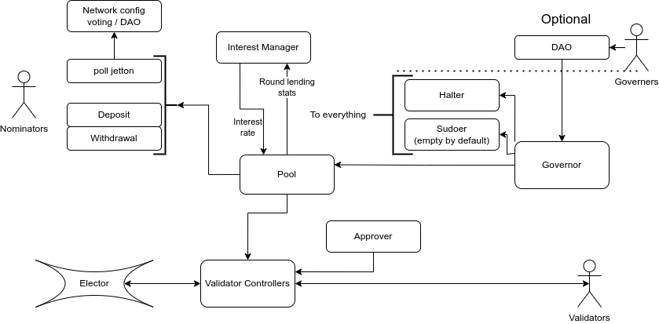

This documentation is organised as follows:
- short description
- list of all components (each component is isolated in separate contract)
- list of all component-to-component interfaces
- list of all multicomponent execution paths

## Description
### Terms
- elector: smart-contract which accepts stakes, conduct election, decides next active validator keys and distribute reward for validation
- Сontroller: smart-contract which manage funds for stake 
- validator: actor which running TON node and (try to) participate in elections, and if elected validate new blocks. It knows it's private validator key and also "partially" control it's own Сontroller (can send and receive stakes, but can not withdraw all money for itself)
- nominator: actor who have assets (TON) and want to lend them to validators through JettonPool to get interest on it
- jettons: TEP-74+TEP-89 Jettons : scalable tokens on TON blockchain

### Scheme

**Validators** participate in elections via **Сontroller** which

1. Requests funds from Validation Pool after getting **Validator approval**
2. accepts and accounts funds from validation pool and validators
3. ensures that assets lended to validators can not be withdrawn
4. sends stake plus agreed on lending interest after validation round to validation pool

**Pool** Central contract:
  - Interact with controllers
    1. Lends assets to Сontrollers upon borrow request from **Сontroller** in accordance to *Current Rate*
    2. Receives assets and aggregates profit/loss information from **Сontrollers**
  - Interaction with stakers
    3. manages deposits and withdrawals
  - Interact with Interest Manager:
    4. sends aggregate lending round statistics
    5. updates interest upon request from Interest Manager
  - Interact with Governor:
    6. sends profits share
    7. updates parameters upon request: deposit params (open?, optimistic?), roles (halter, sudoer, interest_manager, governor), state (unhalt).

**pool jetton** is jetton which is used to manage assets lended to the pool. It also has DAO voting capabilities to be used for voting for network config parameters.

**Deposits/Withdrawals**: pool jetton/TON ratio is updated once per round. In strict mode, we assume that this ratio is not known till the end of the round and thus actual deposits/withdrawals should be postponed till the end of the round. Besides, even in optimistic mode (when deposits/withdrawals are processed through projected ratio), withdrawals often can not be made if pool has no enough TON. Thus **Deposits/Withdrawals** are special contracts which represent deposit/withdrawals in process. Can be implemented as NFT or Jettons so all wallets will be able to interact with it.

#### Roles

**Halter**
Halts all parts of the system if necessary.

**Sudoer**
Empty by default role, which is able to send arbitrary message from arbitrary part of the system. Sudoer only become active if set more than *sudoer_threshold* seconds ago (expected to be 24h). Can upgrade code and directly update data.

**Approver**
Role to approve Controllers for borrow requests

**Interest Manager**
Get round stats and update interest params

**Governor** 
1. set other roles in **Pool**, **Controller**, **Minters**
2. set some parameters (governance fee) in **Pool**

Each role may be performed by a wallet, multisignature wallet or DAO. It is expected that in final revision:
- *Halter* will be a hot wallet which scan blockchain and halts everything in case of unexpected behavior
- *Approver* will be either cold wallet or combined with the *Governance*
- *Interest Manager* will be a smart contract which implements some equilibria logic
- *Governance* will be jetton-based DAO with it's owng GJ: governance jetton. Optionally, filter of outcoming messages can be added that resticts setting sudoer and othe parameters.

## Optimistic deposits/withdrawals
By default it is assumed that ratio pool jetton/TON in unpredictable since validators can be slashed and thus it is impossible with 100% probability say how much pool balance will change on round end. If, indeed, ratio can fluctuate both ways (to increase and to decrease) than we need to postpone all deposits and withdrawals and process them immediately on round end. Otherwise, if lets say one knows that pool validators will be severely slashed and withdraw funds before that, he will avaid loss by distributing it to other holders.

However, since protocol ensures that validator have enough funds to pay expected fines and credit interest is agreed on during loan granting, under normal conditions amount of returned TON on the round end is determined and thus it is possible to calculate projected pool jetton / TON ratio. Given that it is possible to process deposits and withdrawals in *optimistic* mode: deposits should be converted to pool jetton basing on the projected ratio at the end of the round, and withdrawals should be converted to TON basing on the current ratio (like this funds do not work in the round). This optimistic mode should be activated only if there are measures to protect agains validator cheating attemts: for instance validator fully disclose himself.

### Fill or Kill and Immediate withdrawals
If *optimistic* mode is activated, still withdrawals often can not be processed immediately if pool has not enough TONs. In this case Withdrawal bill should be minted which may not be optimal for nominator. At the same time, sometimes nominator want wait till the end of the round to get profit of this round even if *optimistic* mode is on.
To control this behavior there are two flags in burn requests:
- `wait_till_round_end` - if `true` Withdrawal bill will be minted regardless of possibility to make immediate withdrawal
- `fill_or_kill` - if `true` and there is no enough TON, burn will be reverted via minting pool jettons back.

## Components
### Сontroller
Сontroller accounts funds of validator and funds borrowed from Validation Pool. It can process deposits from Validator and from Validation Pool (later Pool).
Upon request from validator it can send stake from it's balance to Elector. Upon request it can requests withdrawal from Elector, but only after at least three updated of validator sets ([here](https://github.com/ton-blockchain/nominator-pool/blob/main/func/pool.fc#L566) is why it is necessary for correct stake account). Thus Controller need ability to "count" validator sets updates, for that purpose there is `update_set_hash` request.
Both withdrawal and `update_set_hash` requests can be sent by validator or, after grace period, by anybody. In the latter case sender gets bounty out of validator funds. This functionality protects against non-responding validator. 

Validator-controler specify maximal interest rate, minimal and maximal TON credit size in borrow request. Validator can only request such parameters that it has interest plus recommended fine on it's balance. It can only request funds if is approved by Approver.

Upon receiving stake from Elector, Сontroller sends borrowed assets plus interest to the Validation pool.

Handlers of incoming messages
- deposit (only from Pool)
- count validator set update (from Validator or anybody after grace period)
- demand to request stake from Elector (from Validator or anybody after grace period)
- deposit Validator (only from Validator)
- withdraw Validator (only from Validator)
- demand to send stake to Elector (only from Validator)
- stake from Elector (only from Elector)
- Governance requests (from Governance, Halter, Sudoer)
- approve/disapprove (from Approver)
bounces
- bounce of sent stake to Elector (only from Elector)

Outcoming messages:
- new_stake (to Elector)
- request state (to Elector)
- Borrowin request (to Pool)
- Debt repayment (to Pool)
- Validator withdrawal (to Validator)

[Detailed docs on Validator controler](docs/controller.md)

If Сontroller doesn't have enough assets to repay debt after stake recovery:
halt Сontroller, and expect that Governance will "manually" decide what to do, for instance wait till validator replenish Сontroller or withdraw everything depending on conditions.

### Pool

#### Controller part
Process lending requests from Validator Approvals: send funds if there are enough funds and request fits rate and limits. Saves to *active controller list* (it is expected that there will be no more than hundreds of those).

Receives debt repayment from validator-controlers: remove them from *active controller list*

Account for fees: send governance fee to governance

Aggregate profit/loss data for each round, ratio of pool jetton/TON, sends stats to Interest Manager

#### User part
Keep track of ratio of pool jetton/TON.

Receives deposits from nominators and mints *Deposit*/*pool jetton* for them.

Receives pool jetton burns notifications (withdrawal requests) from nominators' wallets and mints *Withdrawal*/*TON* for them or revert burn.

Keep track of summs of **current round** payouts (Withdrawals/Deposits).

On aggregation event (lending round end):
- mints pool jetton to *Deposit Payout* minter for distribution
- sends TONs to *Withdrawal Payout* minter to fulfill withdrawals

Handlers of incoming messages
- borrow request (only from Сontroller)
- Governance requests (from Governance, Halter, Sudoer)
- debt repayment (only from Controller in *active controller list*)
- deposits (from any user)
- burn notifications (from pool jetton wallets)
bounces
- TODO

Outcoming messages:
- deposit to controller (to Controller, insert into _active controller list_)
- aggregated profit notification (to Interest Manager)
- Fees to Governance 
- mint pool jetton (to Deposit Payout and nominator)
- TONs (to Withdrawal Payout and nominator)

[Detailed docs on Pool](docs/pool.md)

### Pool jetton
Jetton that represents share in pool assets. It can be implemented as DAO Jetton in such a way that owners of pool jetton will be able to vote for network config updates.

### Payouts

Postponed till the end of the round deposits/withdrawals can be represented on-chain in different form. Two main approaches is to use Jettons and NFT.

### Payout NFT
In this scheme Payout is NFT collection and "conversion obligation" is an NFT. Each round a new payouts collections for deposit and withdrawal are created.

When you deposit TON to pool you immediately get Deposit Bill. Later after current validation round ends and funds are released from Elector, correct poolJetton/TON ratio is discovered, amount of pool jetton corresponded to total deposits value is calculated and sent to Deposit Collection. After that Deposit Collection send *burn request* to the last minted NFT which trigger the conversion of that NFT and simulatneously sending *burn request* ton the NFT before that. Here the idea that NFTs are linked list is used to iterate through whole collection.

This implementation allows processed deposits/withdrawals to be sent to other users as a whole and allows autoconversion to assets when ready. **In current implementation it is the main used mechanism**

### Payout jettons
In this scheme Payout is jetton minter and "conversion obligation" is jettons. Each round a new payouts for deposit and withdrawal are created.

When you deposit TON to pool you immediately get Deposit jettons. Later after current validation round ends and funds are released from Elector, correct poolJetton/TON ratio is discovered, amount of pool jetton corresponded to total deposits value is calculated and sent to Deposit minter. After that Deposit jettons can be burned to retrieve pool jettons from minter. User may burn it herself, however, for convenience special *consigliere* role is introduced which have permissions to call burn from any payout jetton wallet. If successfull (that means if distribution is already started), user gets her pool jettons and *consigliere* reimbursement for fees. That way from user perspective, in a few hours after deposit she automatically gets pool jetton.

This implementation allows processed deposits/withdrawals to be split and sent to other users by parts, however it requires eithere centralised *consigliere* or action from user to convert payout to actual asset when ready.  **This payout scheme is implemented in contract/awaited_minter/ , however it is not currently used and requires additional tests before using**
