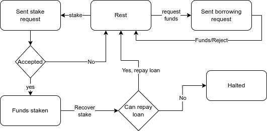

# WIP
# Validator-controller

## Storage

1. Addresses (authorization for different actions)
  - validator address
  - validation pool address
  - halter address
  - sudoer address
  - approver address
2. Round contol (when it is allowed to stake money)
  - `saved_validator_set_hash`
  - `validator_set_changes_count`
  - `validator_set_changes_time`
  - `stake_held_for`
3. Funds control
  - `borrowed_amount`
  - `borrowed_time`
- state
- approval

## Deploy

Validator deploys controller.

Controller address depends on `[validator, pool, governor, halter, approver]`. If any of these addresses changed (rotation of Governor for instance), validator need to deploy new controller (since old one will not pass address based authentication).

`sudoer` by default is `addr_none`.

## Basics
Controller may borrow funds from pool while elections are open.

When borrowing, controller agrees to pay fixed premium for fund usage.

Controller should return funds if not won in election.

Controller should return funds after funds release from elector.

If controller fails to return funds (when possible) during grace period, anybody can trigger funds release and get premium.

## State

Validator controller can be in the following states:
- rest
- sent borrowing request
- sent stake request
- staked funds
- halted (by halter)

Additionally there is flag whether credit is active or not.

Controller may withdraw validator's funds only from "rest" state and `borrowed_amount=0`.

Controller can send borrowing request only from "rest" state.

When Controller receives response on borrowing request it returns to "rest" state. Note, that `borrowed_amount` and `borrowed_time` may be updated. `borrowed_time` only updates if it was `0`.

Controller can send stake request only from "rest" state and only if `now() - borrowed_time < elections_start_before`. In other words, funds can be borrowed only to participate in closest election.

When Controller receives response on stake request it either pass to "funds staken" or returns to "rest" state (depending on response).

Controller can send request to withdraw stake from elector only in "funds staken" state (**TODO** do we need this condition?)

Upon receiving stake withdrawal from elector, if controller has enough funds it should automatically repay debt. If not, it pass to "halted" state.

## Bounce management
Validator sends messages to
1. Elector
  * New stake - bounce should be processed: `SENT_STAKE_REQUEST` -> `REST`
  * Recover stake - bounce can be neglected
2. Pool
  * loan repayment - bounced funds should be added to `borrowed_amount`, `borrowing_time` should be updated too, no change in state
  * request loan - bounce should be processed: `SENT_BORROWING_REQUEST` -> `REST`
3. Validator
  * withdrawal - sent in non-bouncable mode
  * excesses - sent in non-bouncable mode
4. Watchdogs:
  * reward - sent in non-bouncable mode

## Validator duty
1. Validator must perform `update_validator_hash` when funds are staken. If validators doesn't update it during `GRACE` period, anybody can `update_validator_hash` and get `HASH_UPDATE_FINE`. The rule is as following:
> If controller is in "funds staken" state, `validator_set_changes_count < 3`, `borrowed_amount > 0` and `now() - utime_since > GRACE_PERIOD`, anybody can trigger `update_validator_hash` and get reward

2. Validator must recover funds from elector after it being released. Otherwise, anybody can `recover_stake` and get `STAKE_RECOVER_FINE`, in particular:
> If controller is in "funds staken" state, `validator_set_changes_count >= 2`, `borrowed_amount > 0` and `now() - validator_set_changes_time > stake_held_for + GRACE_PERIOD`, anybody can trigger `recover_stake` and get reward

3. If Validator didn't participated in election, he must return unused load. Otherwise, anybody can `return_unused_loan` and get `STAKE_RECOVER_FINE`, in particular:
> If controller is in "rest" state, `borrowed_amount > 0` and `utime_since > borrowed_time`, controller has enough funds on balance, anybody can trigger `return_unused_loan` and get reward
