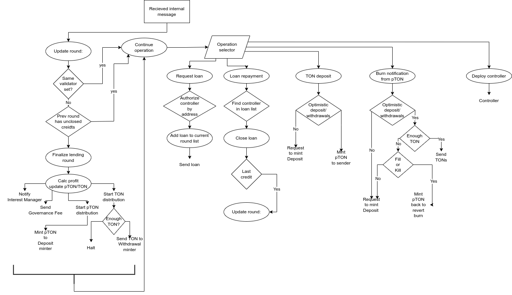

# WIP
# Pool

## Storage

- `state`
- `total_balance` - amount of TONs accounted when deposit, withdraw and profit
- `interest_rate` - surplus of credit that should be returned with credit body. Set as integer equal share of credit volume times `2**24`
- `optimistic_deposit_withdrawals?` - flag notifies whether optimistic mode is enabled
- `deposits_open?` - flag notifies whether deposits are open
- `current_round_borrowers` - Current _round\_data_
  * `borrowers` - dict of borrowers: `controller_address -> borrowed_amount`
  * `round_id`
  * `active_borrowers` - number of borrowers that didn't return loan yet
  * `borrowed` - amount of borrowed TON (no interest)
  * `expected` - amount of TON expected to be returned (`borrowed + interest`)
  * `returned` - amount of already returned TON
  * `profit` - currently obtained profit (at the end of the round should be equal to `returned-borrowed` and `expected-borrowed`)
- `prev_round_borrowers` - Previous _round\_data_
  * `borrowers` - dict of borrowers: `controller_address -> borrowed_amount`
  * `round_id`
  * `active_borrowers` - number of borrowers that didn't return loan yet
  * `borrowed` - amount of borrowed TON (no interest)
  * `expected` - amount of TON expected to be returned (`borrowed + interest`)
  * `returned` - amount of already returned TON
  * `profit` - currently obtained profit (at the end of the round should be equal to `returned-borrowed` and `expected-borrowed`)
- `min_loan_per_validator` - minimal loan volume per validator
- `max_loan_per_validator` - maximal loan volume per validator
- `governance_fee` - share of profit sent to governance

- **Minters Data**
  * pool jetton jetton minter address
  * pool jetton supply
  * Deposit Payout address
  * Deposit Payout supply == number of deposited TON in this round
  * Withdrawal Payout address
  * Withdrawal Payout supply == number of burned pool jettons in this round

- **Roles** addresses
  * sudoer
  * governance
  * interest manager
  * halter
  * approver

- **Codes** - code of child contracts needed either for deploy or for address authorization
  * `controller_code` - needed for controller authorization
  * `payout_code` - needed for Deposit/Withdrawal payouts deployment
  * `pool_jetton_wallet_code` - needed for calculation of address of Deposit Payout wallet

## Deploy

Pool and pool jetton minter are deployed separately. Pool deploys Payout minters and initiates them. Address of pool jetton wallet for Deposit Payout (minter) is calculated on Pool and passed to Deposit Payout in init message.

